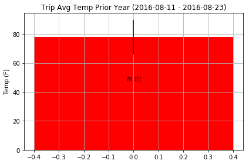

# Surfs Up! Climate Analysis.

### Step 1 - Data Engineering (file data_engineering.ipynb).

We use two csv files: hawaii_measurements.csv and hawaii_stations.csv, and do all the Data Cleaning tasks and save the results
in clean_measurements.csv and clean_stations.csv.

The dependencies use in data_engineering.ipynb file are:

```python
# Dependencies
import os
import pandas as pd
```

#### Cleaning Data  - Table Measurements -

 I calculate the percentage of total missing rows in measurement (Total of missing prcp/ Total rows) and the result of missing data is : 7.40153452685422; so that, I use the interpolate method instead of removing rows with Naan values with df.dropna(axis=0, how='any').

```python

clean_measurements_df = measurements_df.interpolate(method='linear', axis=0).ffill().bfill()
print(f"Totals of missing data in clean_measurements :\n{clean_measurements_df.count()} ")
```

### Step 2 Database Engineering (file database_engineering.ipynb).

With the function  read_base_file,  I read the files clean_measurements.csv and clean_stations.csv in a given directory. The default directory is Resources/

The dependencies use in database_engineering.ipynb file are:

```python
import os
import pandas as pd

# Python SQL toolkit and Object Relational Mapper
import sqlalchemy
#from sqlalchemy import create_engine

from sqlalchemy.ext.declarative import declarative_base
from sqlalchemy import ( Column, 
                         Integer, 
                         String, 
                         DateTime, 
                         Float
)
```


```python
# Use `declarative_base` from SQLAlchemy to model the measurement table
# an station table as an ORM classes

Base = declarative_base()

class Measurements(Base):
    __tablename__ = 'measurement'
    id = Column(Integer, primary_key=True)
    station = Column(String)
    date = Column(String)
    prcp = Column(Float)
    tobs = Column(Integer)
    
class Stations(Base):
    __tablename__ = 'station'
    id = Column(Integer, primary_key=True)
    station = Column(String)
    name = Column(String(255))
    latitude = Column(Float)
    longitude = Column(Float)
    elevation = Column(Float)
```


#### Temperature Analysis

1) Use a function called calc_temps that will accept a start date and end date in the format %Y-%m-%d and return the minimum, average, and maximum temperatures for that range of dates.


```python
def calc_temps(start_date, end_date):
    
    sel = [ func.min(Measurements.tobs), func.max(Measurements.tobs), func.avg(Measurements.tobs),
       (func.max(Measurements.tobs) - func.min(Measurements.tobs))]
           
    stmt = session.query(*sel).filter(Measurements.date.between(start_date, end_date)).first()
                  
    return(stmt)
```

2) Use the calc_temps function to calculate the min, avg, and max temperatures for your trip using the matching dates from the previous year (i.e. use "2017-01-01" if your trip start date was "2018-01-01")

```python
# Find the matching days from the previous years.

end_date = year_ago_date
start_date = get_start_date(end_date, 'N')

temp_analysis = calc_temps(start_date,end_date)

temps = list(np.ravel(temp_analysis))
temps
```

3) Plot the min, avg, and max temperature from your previous query as a bar chart.

    * Use the average temperature as the bar height.
    * Use the peak-to-peak (tmax-tmin) value as the y error bar (yerr).



#### Step 4 Flask Analysis (file flask_analysis.ipynb).
