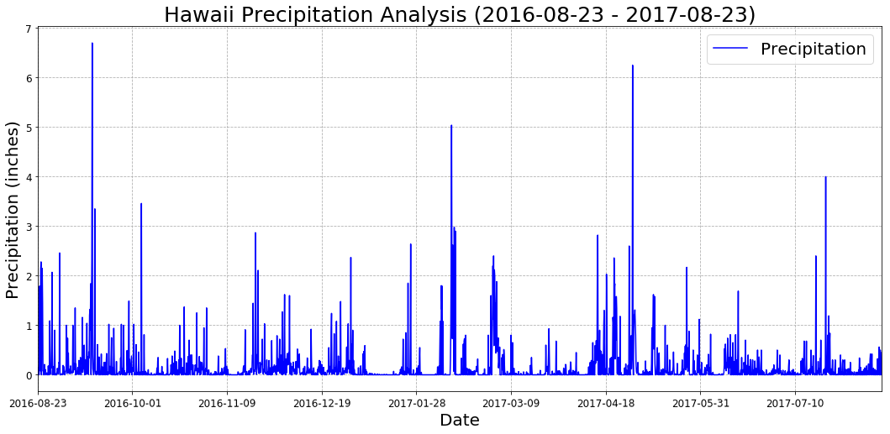
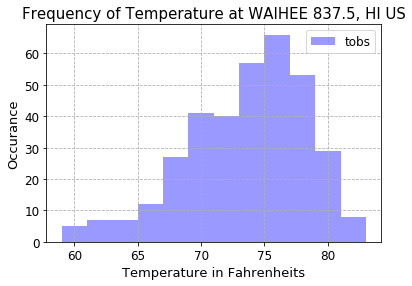
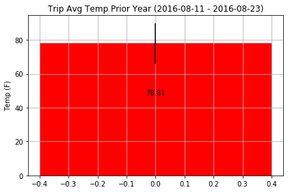

# Surfs Up! Climate Analysis.

### Step 3 - Climate Analysis and Exploration

* Create a Jupyter Notebook file called climate_analysis.ipynb and use it to complete your climate analysis and data exporation.

* Choose a start date and end date for your trip. Make sure that your vacation range is approximately 3-15 days total.

* Use SQLAlchemy create_engine to connect to your sqlite database.

* Use SQLAlchemy automap_base() to reflect your tables into classes and save a reference to those classes called Station and Measurement.


```python
# Dependencies

import pandas as pd
import numpy as np
from datetime import datetime, date
import seaborn as sns
import matplotlib
import matplotlib.pyplot as plt

```


```python
# Python SQL toolkit and Object Relational Mapper

import sqlalchemy
from sqlalchemy.ext.automap import automap_base
from sqlalchemy.orm import Session
from sqlalchemy import create_engine, inspect
from sqlalchemy.sql import func
```


```python
engine = create_engine("sqlite:///hawaii.sqlite", echo=False)
```

### Database Exploration.


```python
inspector = inspect(engine)
inspector.get_table_names()
```


    ['measurement', 'station']


```python
engine.execute('SELECT * FROM measurement LIMIT 5').fetchall()
```


    [(1, 'USC00519397', '2010-01-01', 0.08, 65),
     (2, 'USC00519397', '2010-01-02', 0.0, 63),
     (3, 'USC00519397', '2010-01-03', 0.0, 74),
     (4, 'USC00519397', '2010-01-04', 0.0, 76),
     (5, 'USC00519397', '2010-01-06', 0.03, 73)]


```python
engine.execute('SELECT * FROM station LIMIT 5').fetchall()
```


    [(1, 'USC00519397', 'WAIKIKI 717.2, HI US', 21.2716, -157.8168, 3.0),
     (2, 'USC00513117', 'KANEOHE 838.1, HI US', 21.4234, -157.8015, 14.6),
     (3, 'USC00514830', 'KUALOA RANCH HEADQUARTERS 886.9, HI US', 21.5213, -157.8374, 7.0),
     (4, 'USC00517948', 'PEARL CITY, HI US', 21.3934, -157.9751, 11.9),
     (5, 'USC00518838', 'UPPER WAHIAWA 874.3, HI US', 21.4992, -158.0111, 306.6)]


```python
columns = inspector.get_columns('measurement')
for c in columns:
    print(c['name'], c["type"])
```

    id INTEGER
    station VARCHAR
    date VARCHAR
    prcp FLOAT
    tobs INTEGER
    


```python
columns = inspector.get_columns('station')
for c in columns:
    print(c['name'], c["type"])
```

    id INTEGER
    station VARCHAR
    name VARCHAR(255)
    latitude FLOAT
    longitude FLOAT
    elevation FLOAT
    

### Reflect database 


```python
# Reflect Database into ORM class
Base = automap_base()

# Use the Base class to reflect the database tables
Base.prepare(engine, reflect=True)

# Print all of the classes mapped to the Base
#Base.classes.keys()
```


```python
# Assign the measurement and station  classes to the variables called `Measurements` and 'Stations'
Measurements = Base.classes.measurement
Stations = Base.classes.station

# Create a session
session = Session(engine)
```


```python
# Display the row's columns and data in dictionary format

# measurement_data = session.query(Measurements).first()
# measurement_data.__dict__

# station_data = session.query(Stations).first()
# station_data.__dict__
```

### Precipitation Analysis

* Design a query to retrieve the last 12 months of precipitation data.
* Select only the date and prcp values.
* Load the query results into a Pandas DataFrame and set the index to the date column.
* Plot the results using the DataFrame plot method.
* Use Pandas to print the summary statistics for the precipitation data.


```python
def get_start_date(end_date,t_move):

    endDate = datetime.strptime(end_date, "%Y-%m-%d").date()
    
    # vacation trip was 12 days long
    trip = 12

    # reconstruct date fully
    if t_move == 'Y' :
        startDate = datetime(endDate.year - 1, endDate.month, endDate.day)
    else:
        startDate = datetime(endDate.year, endDate.month, endDate.day-trip)
        
    datetime.strftime(startDate, "%Y-%m-%d").replace(' 0', ' ')

    return (datetime.strftime(startDate, "%Y-%m-%d").replace(' 0', ' '))
```


```python
# Get the last date of the data and find the date one year ago.
qry = session.query(func.max(Measurements.date).label("last_date"))
res = qry.one()
last_date = res.last_date
year_ago_date = get_start_date(last_date, 'Y')

prcp_year_df = pd.read_sql(session.query(Measurements.date,Measurements.prcp).\
        filter(Measurements.date.between(year_ago_date, last_date)).\
        order_by(Measurements.date.asc()).statement, session.bind) 

prcp_year_df.set_index('date')
prcp_year_df.head(10)
```


<div>
<style>
    .dataframe thead tr:only-child th {
        text-align: right;
    }

    .dataframe thead th {
        text-align: left;
    }

    .dataframe tbody tr th {
        vertical-align: top;
    }
</style>
<table border="1" class="dataframe">
  <thead>
    <tr style="text-align: right;">
      <th></th>
      <th>date</th>
      <th>prcp</th>
    </tr>
  </thead>
  <tbody>
    <tr>
      <th>0</th>
      <td>2016-08-23</td>
      <td>0.00</td>
    </tr>
    <tr>
      <th>1</th>
      <td>2016-08-23</td>
      <td>0.15</td>
    </tr>
    <tr>
      <th>2</th>
      <td>2016-08-23</td>
      <td>0.05</td>
    </tr>
    <tr>
      <th>3</th>
      <td>2016-08-23</td>
      <td>0.00</td>
    </tr>
    <tr>
      <th>4</th>
      <td>2016-08-23</td>
      <td>0.02</td>
    </tr>
    <tr>
      <th>5</th>
      <td>2016-08-23</td>
      <td>1.79</td>
    </tr>
    <tr>
      <th>6</th>
      <td>2016-08-23</td>
      <td>0.70</td>
    </tr>
    <tr>
      <th>7</th>
      <td>2016-08-24</td>
      <td>0.08</td>
    </tr>
    <tr>
      <th>8</th>
      <td>2016-08-24</td>
      <td>2.15</td>
    </tr>
    <tr>
      <th>9</th>
      <td>2016-08-24</td>
      <td>2.28</td>
    </tr>
  </tbody>
</table>
</div>


```python
fig = plt.figure()

prcp_year_df.plot(x='date', figsize = (18,8), color='blue' )

plt.title(f"Hawaii Precipitation Analysis ({year_ago_date} - {last_date})" , fontsize=25)
plt.ylabel("Precipitation (inches)", fontsize=20)
plt.xlabel("Date", fontsize=20)
plt.grid(True, ls='dashed')
plt.xticks(rotation=(0.45),size='large')
plt.yticks(size='large')

# Put a legend below current axis
plt.legend(["Precipitation"],loc="best",prop={'size': 20})

#plt.savefig('output/prcp_analysis.png')
plt.show()
```


    <matplotlib.figure.Figure at 0x1af463ba3c8>





### Station Analysis

1. Design a query to calculate the total number of stations.
2. Design a query to find the most active stations.
    * List the stations and observation counts in descending order.
    * Which station has the highest number of observations?
3. Design a query to retrieve the last 12 months of temperature observation data (tobs).
    * Filter by the station with the highest number of observations.
    * Plot the results as a histogram with bins=12

```python
# Total number of stations
total_num_stations = session.query(Stations.station).count()
print(f"Total number  of stations : {total_num_stations} ")


# The most Active stations.
top_stations = session.query(Measurements.station, Stations.name, func.count(Measurements.tobs)).\
            filter(Measurements.station == Stations.station).\
            group_by(Measurements.station).\
            order_by(func.count(Measurements.tobs).desc()).all()
 
print("\nStations and Observations counts :")
top_stations

```

    Total number  of stations : 9 
    
    Stations and Observations counts :
    


    [('USC00519281', 'WAIHEE 837.5, HI US', 2772),
     ('USC00519397', 'WAIKIKI 717.2, HI US', 2724),
     ('USC00513117', 'KANEOHE 838.1, HI US', 2709),
     ('USC00519523', 'WAIMANALO EXPERIMENTAL FARM, HI US', 2669),
     ('USC00516128', 'MANOA LYON ARBO 785.2, HI US', 2612),
     ('USC00514830', 'KUALOA RANCH HEADQUARTERS 886.9, HI US', 2202),
     ('USC00511918', 'HONOLULU OBSERVATORY 702.2, HI US', 1979),
     ('USC00517948', 'PEARL CITY, HI US', 1372),
     ('USC00518838', 'UPPER WAHIAWA 874.3, HI US', 511)]


```python
# Which station has the highest number of observations?

highest_station = top_stations[0:1]
print(" Station: %s with the highest number of observations: %s" \
      % (highest_station[0][0],highest_station[0][2]))
           
```

     Station: USC00519281 with the highest number of observations: 2772
    


```python
# Retrieve the last 12 months of temperature observation data (tobs) 
# for the station with the highest number of observations.

tobs_hgst_station = session.query(Measurements.tobs).\
                      filter(Measurements.station == highest_station[0][0], \
                      Measurements.date.between(year_ago_date, last_date)).all()
    
tobs_hgst_station_df = pd.DataFrame(tobs_hgst_station, columns=[ 'tobs'])
```


```python
# Plot the results as a histogram with bins=12

fig = plt.figure()

# Control the number of bins
sns.distplot(tobs_hgst_station_df["tobs"], bins=12, color='blue', hist=True, kde=False, rug=False )

plt.title(f"Frequency of Temperature at {highest_station[0][1]}", fontsize=15)
plt.figsize = (50,30)
plt.grid(True, ls='dashed')
plt.xlabel("Temperature in Fahrenheits",fontsize=13)
plt.ylabel("Occurance", fontsize=13)
plt.legend(["tobs"],loc="best",prop={'size': 12})

plt.xticks(rotation=(0.45),size='large')
plt.yticks(size='large')

#plt.savefig('output/prcp_analysis.png')
plt.show()

```





### Temperature Analysis

1) Write a function called calc_temps that will accept a start date and end date in the format %Y-%m-%d and return the minimum, average, and maximum temperatures for that range of dates.

2) Use the calc_temps function to calculate the min, avg, and max temperatures for your trip using the matching dates from the previous year (i.e. use "2017-01-01" if your trip start date was "2018-01-01")

3) Plot the min, avg, and max temperature from your previous query as a bar chart.

    * Use the average temperature as the bar height.
    * Use the peak-to-peak (tmax-tmin) value as the y error bar (yerr).


```python
def calc_temps(start_date, end_date):
    
    sel = [ func.min(Measurements.tobs), func.max(Measurements.tobs), func.avg(Measurements.tobs),
       (func.max(Measurements.tobs) - func.min(Measurements.tobs))]
           
    stmt = session.query(*sel).filter(Measurements.date.between(start_date, end_date)).first()
                  
    return(stmt)
```


```python
# Find the matching days from the previous years.

end_date = year_ago_date
start_date = get_start_date(end_date, 'N')

temp_analysis = calc_temps(start_date,end_date)

temps = list(np.ravel(temp_analysis))
temps
```


    [71.0, 83.0, 78.011904761904759, 12.0]


```python

fig, ax = plt.subplots()
bar_chart = ax.bar(0 , temps[2], color= 'red', yerr=[temps[3]])
plt.align = 'center'
plt.figsize = (40,20)
plt.grid(True)
plt.ylabel("Temp (F)")
plt.title(f"Trip Avg Temp Prior Year ({start_date} - {end_date})")

def autolabels(rects):
    for rect in rects:
        h=rect.get_height()
        ax.text(rect.get_x() + rect.get_width()/2., .6*h,'%.2f' % float(h) ,ha='center', va='bottom', fontsize=10)

autolabels(bar_chart)
fig.tight_layout()

plt.show() 

```





### Optional Recommended Analysis
1) Calcualte the rainfall per weather station using the previous year's matching dates.

2) Calculate the daily normals. Normals are the averages for min, avg, and max temperatures.


```python
# Calcualte the rainfall per weather station using the previous year's matching dates.

rain_per_station_df = pd.read_sql(session.query(Measurements.station, Stations.name, 
                                                func.sum(Measurements.prcp).label("rainfall")).\
                                              filter(Measurements.station == Stations.station).\
                                              filter(Measurements.date.between(start_date, end_date)).\
                                              group_by(Measurements.station).statement, session.bind)

rain_per_station_df
```


<div>
<style>
    .dataframe thead tr:only-child th {
        text-align: right;
    }

    .dataframe thead th {
        text-align: left;
    }

    .dataframe tbody tr th {
        vertical-align: top;
    }
</style>
<table border="1" class="dataframe">
  <thead>
    <tr style="text-align: right;">
      <th></th>
      <th>station</th>
      <th>name</th>
      <th>rainfall</th>
    </tr>
  </thead>
  <tbody>
    <tr>
      <th>0</th>
      <td>USC00513117</td>
      <td>KANEOHE 838.1, HI US</td>
      <td>2.110000</td>
    </tr>
    <tr>
      <th>1</th>
      <td>USC00514830</td>
      <td>KUALOA RANCH HEADQUARTERS 886.9, HI US</td>
      <td>0.305000</td>
    </tr>
    <tr>
      <th>2</th>
      <td>USC00516128</td>
      <td>MANOA LYON ARBO 785.2, HI US</td>
      <td>9.420000</td>
    </tr>
    <tr>
      <th>3</th>
      <td>USC00517948</td>
      <td>PEARL CITY, HI US</td>
      <td>0.025714</td>
    </tr>
    <tr>
      <th>4</th>
      <td>USC00519281</td>
      <td>WAIHEE 837.5, HI US</td>
      <td>5.500000</td>
    </tr>
    <tr>
      <th>5</th>
      <td>USC00519397</td>
      <td>WAIKIKI 717.2, HI US</td>
      <td>0.560000</td>
    </tr>
    <tr>
      <th>6</th>
      <td>USC00519523</td>
      <td>WAIMANALO EXPERIMENTAL FARM, HI US</td>
      <td>0.840000</td>
    </tr>
  </tbody>
</table>
</div>


### 2.- Calculate the daily normals. Normals are the averages for min, avg, and max temperatures.

* Create a function called daily_normals that will calculate the daily normals for a specific date. This date string will be in the format %m-%d. Be sure to use all historic tobs that match that date string.
* Create a list of dates for your trip in the format %m-%d. Use the daily_normals function to calculate the normals for each date string and append the results to a list.
* Load the list of daily normals into a Pandas DataFrame and set the index equal to the date.
* Use Pandas to plot an area plot (stacked=False) for the daily normals.


```python
def daily_normals(specdate):
    
    stmt = session.query(Measurements.date, func.min(Measurements.tobs).label("Min temp"), 
                         func.max(Measurements.tobs).label("Max temp"), func.avg(Measurements.tobs).label("Avg temp")).\
                filter(func.strftime("%m-%d", Measurements.date) == specdate).\
                group_by(Measurements.date).order_by(Measurements.date.desc()).all()
    
    return(stmt)
    
```


```python
# spec_date = input('Enter a specific date "%m-%d": ')

#tempspec_date=daily_normals(spec_date)

# tempspec_date_df = pd.DataFrame(tempspec_date, columns=['date', "Min Temp", "Max Temp", "Avg Temp"])
# tempspec_date_df
```
